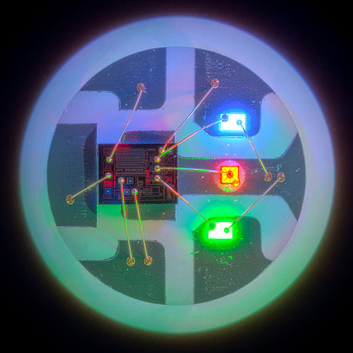

# RGB Flashing Lights

In this exercise, you'll learn how to get your CPE board to automatically change colors from Red, Green, and Blue every 0.5 seconds.  You will also learn about the following programming, Python, and other concepts:

* The NeoPixel LED
* Color scales using RGB
* Tuples
* The "modulo" or "mod" (`%`) operator

## Required Setup

In this exercise you'll need the following:

* The CPX board, connected to your computer
* VsCode (or your fav editor) open with the `code.py` file open

## Key Concepts

### The NeoPixel LED

The NeoPixel LED is a simple output device that is used to create lighted colors on your CPX board.  These LEDs are actually 3 LEDs in one!

[](https://blog.adafruit.com/2017/12/12/neopixels-five-years-in-adafruit-neopixels/)

There are three colored LEDs that make up this NeoPixel; Red, Green, and Blue (RGB).  By combining various combinations of these LEDs, the Neopixel is able to provide a wide range of different colors.

### Color Scales Using RGB

Since the NeoPixel uses the Red, Green, Blue LED's to create different colors, you should learn how to create different colors using the RGB color model.  The RGB color model consists of defining three number values ranging from 0 to 255 as an intensity for the three colors.  The first number is always Red, the second Green, and the third Blue.  

Lets say you have an RGB value of 0, 0, 255 that would mean that the intensity of Blue is full and the other two colors is 0.  This means that the color shown is Blue!  The same goes for Red (255, 0, 0) and Green (0, 255, 0).  You can combine the intensities of different colors to generate another color!  255, 255, 0 would produce Yellow for example.  With these combination there is 255 * 255 * 255 or 16,581,375 different colors!  

https://www.rapidtables.com/web/color/RGB_Color.html


### Tuples

* What is a tuple?
* How do you create a tuple in Python

In Python (and some other programming) languages, tuples are used as a way to store a sequence of objects.  What makes tuples unique from other sequences, is that once they are defined, they are immutable, or they cannot be changed.  To create a tuple in Python, you assign a variable a set of objects separated by a comma (`,`):

```pycon
>>> my_first_tuple = 1, 2, 3
>>> my_first_tuple
(1, 2, 3)
```

Typically, this assignment is also surrounded by parenthesis as well, BUT is not required.  However, I highly recommend that you do this for readability sake:

```pycon
>>> my_first_tuple = (1, 2, 3)
>>> my_first_tuple
(1, 2, 3)
```

When working with the NeoPixel LEDs, they require passing in a tuple that represents the RGB value to change their color.

### The "Modulo" or "Mod" (`%`) Operator

The modulo or mod operator in Python is the percent (`%`) symbol.  The modulo operator is basically the remainder of a division.  For example, if we were to take 2 / 3, the answer would be 0 with a remainder of 2.  Now lets take 3 / 3, the answer would be 1 with remainder of 0.  Finally let's take 4 / 3, the answer is 1 with remainder of 1.  Getting the remainder value is done by using the modulo operator:

```pycon
>>> 2 % 3
2
>>> 3 % 3
0
>>> 4 % 3
1
```

## Putting It All Together

Go ahead and open up [`code.py`](code.py) associated with this exercise and copy and paste into the `code.py` on your CPE board.

What should be happening?

## Troubleshooting

Here are some common problems when running this exercise and how to solve them.  If you run into a different problem, feel free to create a github issue
